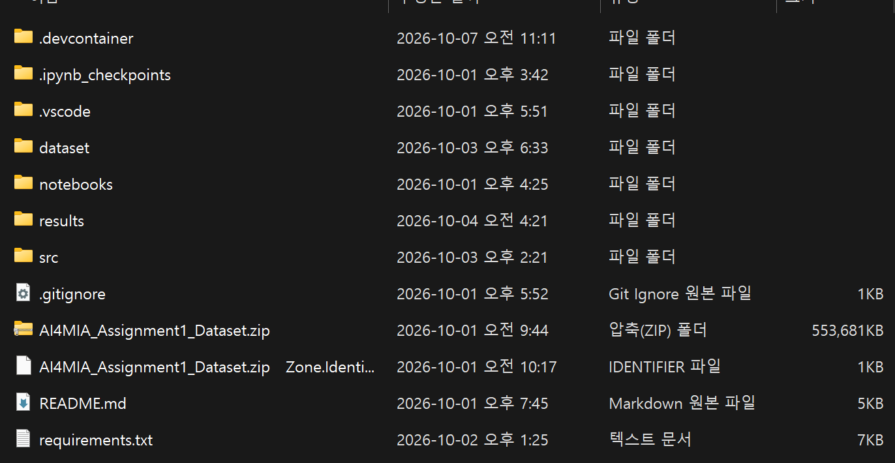
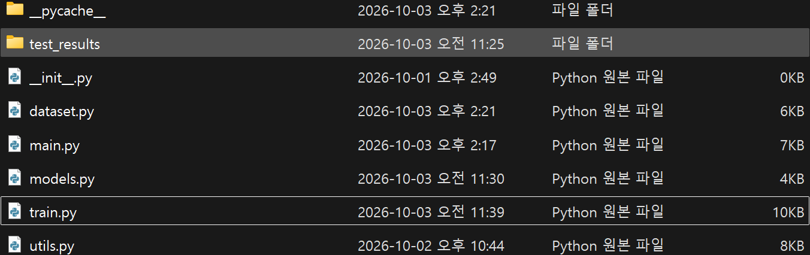

# Code

The workspace directory is structured as illustrated below.


The source scripts are located within the `src` folder, as shown below.


All models were trained for 20 epochs, which proved sufficient to achieve satisfactory accuracy.

## models.py

Convenient model classes from the `torchvision.models` module were utilized. Because the models were pretrained on ImageNet, a new `nn.Linear` layer was appended as the final layer to match the target number of classes.

```py
import torch
import torch.nn as nn
import torchvision.models as models

class MedicalImageClassifier(nn.Module):
    """
    Unified model class
    """
    def __init__(self, model_name: str = 'resnet', pretrained: bool = True, num_classes: int = 3):
        super(MedicalImageClassifier, self).__init__()
        self.model_name = model_name.lower()
        self.pretrained = pretrained
        self.num_classes = num_classes

        self.model = self._build_model()

    def _build_model(self):
        # 1. AlexNet
        if self.model_name == 'alexnet':
            weights = models.AlexNet_Weights.DEFAULT if self.pretrained else None
            model = models.alexnet(weights=weights)
            in_features = model.classifier[6].in_features
            model.classifier[6] = nn.Linear(in_features, self.num_classes)

        # 2. ResNet
        elif self.model_name == 'resnet':
            weights = models.ResNet50_Weights.DEFAULT if self.pretrained else None
            model = models.resnet50(weights=weights)
            in_features = model.fc.in_features
            model.fc = nn.Linear(in_features, self.num_classes)

        # 3. GoogLeNet
        elif self.model_name == 'googlenet':
            weights = models.GoogLeNet_Weights.DEFAULT if self.pretrained else None
            model = models.googlenet(weights=weights, aux_logits=True)

            in_features = model.fc.in_features
            model.fc = nn.Linear(in_features, self.num_classes)

            model.aux1.fc2 = nn.Linear(model.aux1.fc2.in_features, self.num_classes)
            model.aux2.fc2 = nn.Linear(model.aux2.fc2.in_features, self.num_classes)
        else:
            raise ValueError(f"Unsupported model: {self.model_name}. Choose one of 'alexnet', 'resnet', 'googlenet'")

        return model

    def forward(self, x):
        return self.model(x)

    def compute_loss(self, outputs, labels, criterion):
        """
        Model specific loss computation 
        """
        if self.model_name == 'googlenet' and self.training:
            # GoogLeNetOutputs or tuple: (main, aux2, aux1)
            main_out, aux2_out, aux1_out = outputs
            loss_main = criterion(main_out, labels)
            loss_aux2 = criterion(aux2_out, labels)
            loss_aux1 = criterion(aux1_out, labels)
            
            return loss_main + 0.3 * loss_aux2 + 0.3 * loss_aux1
            
        return criterion(outputs, labels)

    def get_predictions(self, outputs):
        """
        Logit extraction to compute final accuracy
        """
        if self.model_name == 'googlenet' and self.training:
            return outputs[0]
            
        return outputs
```
Since GoogLeNet incorporates auxiliary outputs for auxiliary losses, a dedicated `compute_loss` method is required to handle them appropriately.

## train.py

The `Trainer` class manages the comprehensive training and validation loops, along with logging functionalities. In addition to standard procedures, extended evaluation metrics and visual figures were incorporated to facilitate a deeper, more rigorous analysis of model behavior and internal learning dynamics.

```py
import os
import json
import torch
import torch.nn as nn
import torch.nn.functional as F
from torch.utils.data import DataLoader, TensorDataset
from tqdm import tqdm
import numpy as np
from sklearn.metrics import classification_report

from utils import MetricTracker, ModelEvaluator, FeatureMapLogger, log_parameter_histograms

class Trainer:
    """
    Unified class for train, validation, test, and logging.
    """
    def __init__(self, model: nn.Module, train_loader: DataLoader, val_loader: DataLoader,
                 criterion: nn.Module, optimizer: torch.optim.Optimizer, device: torch.device,
                 class_names: list, num_epochs: int = 20, save_dir: str = "results",
                 feature_layer: nn.Module = None):
        """
        Args:
            model (nn.Module): PyTorch model to train
            train_loader (DataLoader): Train data loader
            val_loader (DataLoader): Validation data loader
            criterion (nn.Module): Loss function
            optimizer (torch.optim.Optimizer): Optimizer
            device (torch.device): Hardware (CPU or CUDA)
            class_names (list): Class names of target
            num_epochs (int): Total training epochs
            save_dir (str): Result saving path (Default: "results")
            feature_layer (nn.Module, optional): A layer to extract and visualize a feature map
        """
        self.model = model.to(device)
        self.train_loader = train_loader
        self.val_loader = val_loader
        self.criterion = criterion
        self.optimizer = optimizer
        self.device = device
        self.class_names = class_names
        self.num_epochs = num_epochs
        
        self.results_dir = save_dir
        self.checkpoints_dir = os.path.join(self.results_dir, "checkpoints")
        self.figures_dir = os.path.join(self.results_dir, "figures")
        
        os.makedirs(self.checkpoints_dir, exist_ok=True)
        os.makedirs(self.figures_dir, exist_ok=True)
        
        self.best_model_path = os.path.join(self.checkpoints_dir, "best_model.pth")
        
        self.metric_tracker = MetricTracker(save_dir=self.figures_dir)
        self.evaluator = ModelEvaluator(class_names=class_names, save_dir=self.figures_dir)
        
        self.feature_logger = None
        if feature_layer is not None:
            self.feature_logger = FeatureMapLogger(feature_layer, save_dir=self.figures_dir)

    def _train_epoch(self):
        self.model.train()
        running_loss = 0.0
        correct = 0
        total = 0
        
        pbar = tqdm(self.train_loader, desc="Training", leave=False)
        for inputs, labels in pbar:
            inputs, labels = inputs.to(self.device), labels.to(self.device)
            
            self.optimizer.zero_grad()
            outputs = self.model(inputs)
            #loss = self.criterion(outputs, labels)
            loss = self.model.compute_loss(outputs, labels, self.criterion)
            
            loss.backward()
            self.optimizer.step()
            
            running_loss += loss.item() * inputs.size(0)
            #_, predicted = torch.max(outputs, 1)
            preds_out = self.model.get_predictions(outputs)
            _, predicted = torch.max(preds_out, 1)
            total += labels.size(0)
            correct += (predicted == labels).sum().item()
            
            pbar.set_postfix({"Loss": f"{loss.item():.4f}"})
            
        return running_loss / total, correct / total

    def _validate_epoch(self, return_predictions=False):
        self.model.eval()
        running_loss = 0.0
        correct = 0
        total = 0
        
        all_labels = []
        all_preds = []
        all_probs = []
        
        with torch.no_grad():
            pbar = tqdm(self.val_loader, desc="Validating", leave=False)
            for inputs, labels in pbar:
                inputs, labels = inputs.to(self.device), labels.to(self.device)
                outputs = self.model(inputs)
                loss = self.criterion(outputs, labels)
                
                running_loss += loss.item() * inputs.size(0)
                probs = F.softmax(outputs, dim=1)
                _, predicted = torch.max(outputs, 1)
                
                total += labels.size(0)
                correct += (predicted == labels).sum().item()
                
                if return_predictions:
                    all_labels.extend(labels.cpu().numpy())
                    all_preds.extend(predicted.cpu().numpy())
                    all_probs.extend(probs.cpu().numpy())
                    
        epoch_loss = running_loss / total
        epoch_acc = correct / total
        
        if return_predictions:
            return epoch_loss, epoch_acc, np.array(all_labels), np.array(all_preds), np.array(all_probs)
        return epoch_loss, epoch_acc

    def fit(self):
        """Run training and validation loop."""
        print(f"--- Traning start (Device: {self.device}, Epochs: {self.num_epochs}) ---")
        best_val_acc = 0.0
        
        for epoch in range(1, self.num_epochs + 1):
            print(f"\nEpoch {epoch}/{self.num_epochs}")
            
            train_loss, train_acc = self._train_epoch()
            val_loss, val_acc = self._validate_epoch()
            
            print(f"Train Loss: {train_loss:.4f} | Train Acc: {train_acc:.4f}")
            print(f"Val Loss:   {val_loss:.4f} | Val Acc:   {val_acc:.4f}")
            
            # Record metrics
            self.metric_tracker.update(epoch, train_loss, val_loss, train_acc, val_acc)
            
            # Parameter histograms
            log_parameter_histograms(self.model, epoch, save_dir=self.figures_dir)
            
            # Feature maps
            if self.feature_logger is not None:
                self.feature_logger.plot_feature_map(epoch_or_name=f"epoch_{epoch}")
            
            # Save best modelse
            if val_acc > best_val_acc:
                best_val_acc = val_acc
                torch.save(self.model.state_dict(), self.best_model_path)
                print(f"[*] Best model saved at epoch {epoch} with Val Acc: {best_val_acc:.4f}")
                
        print("--- Training finished ---")
        
        # 1. Learning curve plot
        self.metric_tracker.save_and_plot()
        
        # 2. Final metrics as json
        self._evaluate_final_model()


    def _evaluate_final_model(self):
        """Load best model and create metrics.json"""
        print("--- Final model evaluation ---")
        self.model.load_state_dict(torch.load(self.best_model_path))
        
        _, _, y_true, y_pred, y_prob = self._validate_epoch(return_predictions=True)
        
        self.evaluator.evaluate(y_true, y_pred, y_prob)
        
        report_dict = classification_report(y_true, y_pred, target_names=self.class_names, output_dict=True)
        metrics_path = os.path.join(self.results_dir, "metrics.json")
        
        with open(metrics_path, "w", encoding="utf-8") as f:
            json.dump(report_dict, f, indent=4, ensure_ascii=False)
            
        print(f"[Complete] Final metrics saved at: {metrics_path}")
        print(f"[Complete] Checkpoint and visualization saved at '{self.results_dir}/'")
        
        if self.feature_logger is not None:
            self.feature_logger.remove_hook()
``` 

## dataset.py

`ProcessedDataset` is a simple wrapper class that is compatible with PyTorch's `DataLoader` class. The `load_data` function is designed to cache preprocessed datasets in `.pt` format for fast loading. Furthermore, since the raw class labels from `ImageFolder` differ from the specific conditions of the assignment, label remapping logic is also included. 

To address the class imbalance, the `get_loaders` function returns data loaders configured with a stratified train-validation-test split.

```py
import os
import torch
import numpy as np
from torchvision import datasets, transforms
from torch.utils.data import DataLoader, Subset, Dataset
from sklearn.model_selection import train_test_split

# configuration variables
DATA_ROOT = "dataset"
RAW_DIR = os.path.join(DATA_ROOT, "raw")
PROCESSED_DIR = os.path.join(DATA_ROOT, "processed")

class ProcessedDataset(Dataset):
    """Wrapper class to read saved .pt tensor dataset"""
    def __init__(self, data_dict):
        self.images = data_dict['images']
        self.targets = data_dict['labels']

    def __len__(self):
        return len(self.images)

    def __getitem__(self, idx):
        return self.images[idx], self.targets[idx]


def load_data(raw_dir: str, processed_dir: str, transform=None, use_saved: bool = True, save_processed: bool = False):
    """
    main function to load dataset
    - use_saved=True: If saved .pt file exists, than load that.
    - save_processed=True: When load raw data, transform and save them to the .pt tensors to load faster later.
    """
    processed_path = os.path.join(processed_dir, "processed_dataset.pt")

    if use_saved and os.path.exists(processed_path):
        print(f"---Loading saved .pt tensor dataset: {processed_path} ---")
        data = torch.load(processed_path)
        return ProcessedDataset(data)

    print(f"--- Loading raw dataset: {raw_dir} ---")
    dataset = datasets.ImageFolder(root=raw_dir, transform=transform)
    
    print("Remapping class labels")
    orig_idx_covid = dataset.class_to_idx['COVID']
    orig_idx_normal = dataset.class_to_idx['Normal']
    orig_idx_viral = dataset.class_to_idx['Viral Pneumonia']
    
    mapping = {
        orig_idx_normal: 0,
        orig_idx_viral: 1,
        orig_idx_covid: 2
    }
    
    dataset.targets = [mapping[t] for t in dataset.targets]
    dataset.samples = [(path, mapping[t]) for path, t in dataset.samples]
    dataset.classes = ['Normal', 'Viral pneumonia', 'COVID-19']
    dataset.class_to_idx = {'Normal': 0, 'Viral pneumonia': 1, 'COVID-19': 2}

    if save_processed:
        print(f"--- Saving processed .pt data at {processed_dir} folder... ---")
        os.makedirs(processed_dir, exist_ok=True)
        
        images, labels = [], []
        for img, label in dataset:
            images.append(img)
            labels.append(label)
            
        torch.save({
            'images': torch.stack(images),
            'labels': torch.tensor(labels)
        }, processed_path) 
        print(f".pt tensor dataset saved at: {processed_path}")
    else:
        print("Dataset will be processed by DataLoader")
        
    return dataset


def get_loaders(dataset, split_ratio: dict = None, batch_size: int = 32, num_workers: int = 4):
    """
    Stratified Split for class imbalance and instantiate DataLoader
    """
    if split_ratio is None:
        split_ratio = {'train': 0.8, 'val': 0.2, 'test': 0.0}

    print(f"Dataset split ratio: {split_ratio}")
    print(f"Batch Size: {batch_size}, Num Workers: {num_workers}")
    
    targets = np.array(dataset.targets)
    indices = np.arange(len(dataset))
    
    train_ratio = split_ratio.get('train', 0.8)
    val_ratio = split_ratio.get('val', 0.2)
    test_ratio = split_ratio.get('test', 0.0)

    try:
        if test_ratio > 0.0:
            train_idx, temp_idx, _, temp_targets = train_test_split(
                indices, targets,
                stratify=targets,
                test_size=(val_ratio + test_ratio),
                random_state=42
            )
            val_idx, test_idx = train_test_split(
                temp_idx,
                stratify=temp_targets,
                test_size=(test_ratio / (val_ratio + test_ratio)),
                random_state=42
            )
        else:
            train_idx, val_idx = train_test_split(
                indices,
                stratify=targets,
                test_size=val_ratio,
                random_state=42
            )
            test_idx = []

        train_dataset = Subset(dataset, train_idx)
        val_dataset = Subset(dataset, val_idx)
        test_dataset = Subset(dataset, test_idx) if len(test_idx) > 0 else None

        print(f"Splitted as: Train={len(train_dataset)}, Val={len(val_dataset)}, Test={len(test_dataset) if test_dataset else 0}")

        loaders = {
            "train_loader": DataLoader(train_dataset, batch_size=batch_size, shuffle=True, num_workers=num_workers, pin_memory=True),
            "val_loader": DataLoader(val_dataset, batch_size=batch_size, shuffle=False, num_workers=num_workers, pin_memory=True)
        }
        
        if test_dataset:
            loaders["test_loader"] = DataLoader(test_dataset, batch_size=batch_size, shuffle=False, num_workers=num_workers, pin_memory=True)

        return loaders

    except Exception as e:
        print(f"Error during dataset split: {e}")
        raise RuntimeError("Failed to instantiate Stratified DataLoader")
```

## utils.py

This script is dedicated to logging and metrics evaluation. It utilizes designated objects to record and generate a comprehensive set of outputs, including losses, accuracies, classification reports, confusion matrices, ROC curves, PR curves, intermediate feature maps, and parameter histograms.

```py
import os
import torch
import numpy as np
import pandas as pd
import matplotlib
matplotlib.use('Agg')
import matplotlib.pyplot as plt
import seaborn as sns
from sklearn.metrics import (
    classification_report, confusion_matrix, 
    roc_curve, auc, precision_recall_curve
)
from sklearn.preprocessing import label_binarize

class MetricTracker:
    """Track epoch-wise loss and accuracy, and save them as figures and csv"""
    def __init__(self, save_dir="results"):
        self.save_dir = save_dir
        os.makedirs(self.save_dir, exist_ok=True)
        self.history = {
            'epoch': [], 'train_loss': [], 'val_loss': [], 
            'train_acc': [], 'val_acc': []
        }

    def update(self, epoch, train_loss, val_loss, train_acc, val_acc):
        self.history['epoch'].append(epoch)
        self.history['train_loss'].append(train_loss)
        self.history['val_loss'].append(val_loss)
        self.history['train_acc'].append(train_acc)
        self.history['val_acc'].append(val_acc)

    def save_and_plot(self):
        # CSV
        df = pd.DataFrame(self.history)
        csv_path = os.path.join(self.save_dir, "training_history.csv")
        df.to_csv(csv_path, index=False)

        # Loss curve figure
        plt.figure(figsize=(10, 5))
        plt.plot(self.history['epoch'], self.history['train_loss'], label='Train Loss')
        plt.plot(self.history['epoch'], self.history['val_loss'], label='Val Loss')
        plt.title('Loss Curve')
        plt.xlabel('Epochs')
        plt.ylabel('Loss')
        plt.legend()
        plt.grid(True)
        plt.savefig(os.path.join(self.save_dir, "loss_curve.png"))
        plt.close()

        # Accuracy Curve figure
        plt.figure(figsize=(10, 5))
        plt.plot(self.history['epoch'], self.history['train_acc'], label='Train Acc')
        plt.plot(self.history['epoch'], self.history['val_acc'], label='Val Acc')
        plt.title('Accuracy Curve')
        plt.xlabel('Epochs')
        plt.ylabel('Accuracy')
        plt.legend()
        plt.grid(True)
        plt.savefig(os.path.join(self.save_dir, "accuracy_curve.png"))
        plt.close()


class ModelEvaluator:
    """Generate Report, Confusion Matrix, ROC, PR Curve based on the model's prediction"""
    def __init__(self, class_names, save_dir="results"):
        self.class_names = class_names
        self.num_classes = len(class_names)
        self.save_dir = save_dir
        os.makedirs(self.save_dir, exist_ok=True)

    def evaluate(self, y_true, y_pred, y_prob):
        """
        y_true: GT label (1D Array)
        y_pred: Predicted label (1D Array)
        y_prob: Predicted class probabilities (2D Array, N x C)
        """
        self._save_classification_report(y_true, y_pred)
        self._plot_confusion_matrix(y_true, y_pred)
        self._plot_roc_curve(y_true, y_prob)
        self._plot_pr_curve(y_true, y_prob)

    def _save_classification_report(self, y_true, y_pred):
        # Save Classification Report as .txt
        report = classification_report(y_true, y_pred, target_names=self.class_names, digits=4)
        with open(os.path.join(self.save_dir, "classification_report.txt"), "w") as f:
            f.write(report)

    def _plot_confusion_matrix(self, y_true, y_pred):
        cm = confusion_matrix(y_true, y_pred)
        plt.figure(figsize=(8, 6))
        sns.heatmap(cm, annot=True, fmt='d', cmap='Blues', xticklabels=self.class_names, yticklabels=self.class_names)
        plt.title('Confusion Matrix')
        plt.ylabel('True Label')
        plt.xlabel('Predicted Label')
        plt.savefig(os.path.join(self.save_dir, "confusion_matrix.png"))
        plt.close()

    def _plot_roc_curve(self, y_true, y_prob):
        y_true_bin = label_binarize(y_true, classes=range(self.num_classes))
        plt.figure(figsize=(8, 6))
        
        for i in range(self.num_classes):
            fpr, tpr, _ = roc_curve(y_true_bin[:, i], y_prob[:, i])
            roc_auc = auc(fpr, tpr)
            plt.plot(fpr, tpr, label=f'{self.class_names[i]} (AUC = {roc_auc:.4f})')

        plt.plot([0, 1], [0, 1], 'k--', label='Random')
        plt.xlim([0.0, 1.0])
        plt.ylim([0.0, 1.05])
        plt.xlabel('False Positive Rate (1 - Specificity)')
        plt.ylabel('True Positive Rate (Sensitivity)')
        plt.title('Receiver Operating Characteristic (ROC) Curve')
        plt.legend(loc="lower right")
        plt.grid(True)
        plt.savefig(os.path.join(self.save_dir, "roc_curve.png"))
        plt.close()

    def _plot_pr_curve(self, y_true, y_prob):
        y_true_bin = label_binarize(y_true, classes=range(self.num_classes))
        plt.figure(figsize=(8, 6))
        
        for i in range(self.num_classes):
            precision, recall, _ = precision_recall_curve(y_true_bin[:, i], y_prob[:, i])
            plt.plot(recall, precision, label=f'{self.class_names[i]}')

        plt.xlabel('Recall (Sensitivity)')
        plt.ylabel('Precision')
        plt.title('Precision-Recall (PR) Curve')
        plt.legend(loc="lower left")
        plt.grid(True)
        plt.savefig(os.path.join(self.save_dir, "pr_curve.png"))
        plt.close()


class FeatureMapLogger:
    """Extract and visualize Intermediate Feature Map of specified layer"""
    def __init__(self, module, save_dir="results/feature_maps"):
        self.save_dir = save_dir
        os.makedirs(self.save_dir, exist_ok=True)
        self.feature_map = None
        self.hook = module.register_forward_hook(self._hook_fn)

    def _hook_fn(self, module, input, output):
        # Save 1st sample's feature map only (Channels, H, W)
        self.feature_map = output[0].detach().cpu()

    def plot_feature_map(self, epoch_or_name, num_channels=16):
        """Visualize saved feature map's first few channels"""
        if self.feature_map is None:
            print("Feature map is empty. Run a forward pass first.")
            return
            
        c, h, w = self.feature_map.shape
        plot_c = min(c, num_channels)
        
        fig, axes = plt.subplots(int(np.ceil(plot_c/4)), 4, figsize=(12, 12))
        fig.suptitle(f"Feature Maps at {epoch_or_name}", fontsize=16)
        
        for i, ax in enumerate(axes.flat):
            if i < plot_c:
                ax.imshow(self.feature_map[i].numpy(), cmap='viridis')
                ax.axis('off')
            else:
                ax.axis('off')
                
        plt.tight_layout()
        plt.savefig(os.path.join(self.save_dir, f"feature_map_{epoch_or_name}.png"))
        plt.close()

    def remove_hook(self):
        self.hook.remove()


def log_parameter_histograms(model, epoch, save_dir="results/histograms"):
    """Save model weights' histograms"""
    os.makedirs(save_dir, exist_ok=True)
    plt.figure(figsize=(15, 10))
    
    # Only visualize Conv2d and Linear layers' weights
    params = [p.detach().cpu().numpy().flatten() for n, p in model.named_parameters() 
              if p.requires_grad and ('weight' in n) and ('conv' in n or 'fc' in n or 'classifier' in n)]
    
    if not params:
        return
        
    for i, p in enumerate(params[:6]):  # Draw first 6 weights
        plt.subplot(2, 3, i + 1)
        sns.histplot(p, bins=50, kde=True)
        plt.title(f'Layer {i+1} Weights')
        
    plt.suptitle(f'Parameter Distributions at Epoch {epoch}')
    plt.tight_layout()
    plt.savefig(os.path.join(save_dir, f"param_hist_epoch_{epoch}.png"))
    plt.close()
```

## main.py
This script serves as the entry point for the entire training and validation pipeline, incorporating comprehensive logging. It parses terminal arguments via the `parse_args` function, establishes a random seed using the `set_seed` function for reproducibility, and executes the primary workflow through the `main` function. Configurable via command-line arguments, the pipeline supports various model architectures and diverse data augmentation strategies.

```py
import os
import argparse
import torch
import torch.nn as nn
import torch.optim as optim
from torchvision import transforms

from dataset import load_data, get_loaders
from models import MedicalImageClassifier
from train import Trainer

def parse_args():
    parser = argparse.ArgumentParser(description="AI4MIA Week5: COVID-19 Image Classification Project")
    
    # Directory configurations
    parser.add_argument('--raw_dir', type=str, default='dataset/raw', help='Path to raw dataset directory')
    parser.add_argument('--processed_dir', type=str, default='dataset/processed', help='Path to preprocessed dataset directory')
    parser.add_argument('--results_dir', type=str, default='results', help='Path to root directory of resultant directories')
    
    # Data loading configurations
    parser.add_argument('--use_saved', action='store_true', help='Use preprocessed .pt tensor dataset')
    parser.add_argument('--save_processed', action='store_true', help='Save raw data to .pt tensors')
    parser.add_argument('--num_workers', type=int, default=4, help='DataLoader parameter')
    parser.add_argument('--augment', type=str, default='none',
                        choices=['none', 'all', 'flip', 'rotation', 'crop'], help="Data augmentation to train with more data. 'all' means all possible augmentations. Default is 'none'")
    
    # Model selection and hyperparameters
    parser.add_argument('--model_name', type=str, default='resnet', 
                        choices=['resnet', 'alexnet', 'googlenet', 'all'], help='Model classes to train and validation, "all" means all possible models')
    parser.add_argument('--scratch', action='store_true', help='Not to use pretrained weights and to train models from scratches')
    parser.add_argument('--epochs', type=int, default=20, help='Maximum epochs to train')
    parser.add_argument('--batch_size', type=int, default=32, help='The number of samples in a batch')
    parser.add_argument('--lr', type=float, default=0.001, help='Learning Rate')
    parser.add_argument('--seed', type=int, default=42, help='Random seed for reproducibility')
    
    return parser.parse_args()

def set_seed(seed):
    """Random seed setting for reproducibility"""
    torch.manual_seed(seed)
    torch.cuda.manual_seed(seed)
    torch.cuda.manual_seed_all(seed)
    torch.backends.cudnn.deterministic = True
    torch.backends.cudnn.benchmark = False

def main():
    args = parse_args()
    set_seed(args.seed)
    
    device = torch.device("cuda" if torch.cuda.is_available() else "cpu")
    print(f"[*] Device: {device}")
    
    # 1. Base resize (applied to all conditions)
    transform_list = [transforms.Resize((224, 224))]

    # 2. Conditional augmentations
    if args.augment == "flip":
        transform_list.append(transforms.RandomHorizontalFlip())
    elif args.augment == "rotation":
        transform_list.append(transforms.RandomRotation(15))
    elif args.augment == "crop":
        transform_list.append(transforms.RandomResizedCrop(224))
    elif args.augment == "all":
        transform_list.extend([
            transforms.RandomHorizontalFlip(),
            transforms.RandomRotation(15),
            transforms.RandomResizedCrop(224)
        ])
    elif args.augment == "none":
        pass  # Do nothing
    else:
        raise ValueError(f"Unsupported augmentation option: {args.augment}")

    # 3. Tensor conversion and Normalization
    transform_list.extend([
        transforms.ToTensor(),
        transforms.Normalize(mean=[0.485, 0.456, 0.406], std=[0.229, 0.224, 0.225])
    ])

    # 4. Pass the list to Compose
    transform = transforms.Compose(transform_list)
    print(f"{args.augment} is applied for data augmentation.")

    dataset = load_data(
        raw_dir=args.raw_dir,
        processed_dir=args.processed_dir + "_" + args.augment,
        transform=transform,
        use_saved=args.use_saved,
        save_processed=args.save_processed
    )    
    split_ratio = {'train': 0.8, 'val': 0.1, 'test': 0.1}
    loaders = get_loaders(
        dataset, 
        split_ratio=split_ratio, 
        batch_size=args.batch_size, 
        num_workers=args.num_workers
    )
    
    class_names = ['Normal', 'Viral Pneumonia', 'COVID-19']
    num_classes = len(class_names)
    
    if args.model_name == 'all':
        models_to_run = ['resnet', 'alexnet', 'googlenet']
        modes = [False, True]  # False = Pretrained, True = Scratch
        runs = [(m, s) for m in models_to_run for s in modes]
    else:
        runs = [(args.model_name, args.scratch)]

    print(f"[*] Total {len(runs)} number of training sessions will run sequentially.\n" + "="*50)

    for run_idx, (model_name, is_scratch) in enumerate(runs, 1):
        pretrained = not is_scratch
        mode_str = "scratch" if is_scratch else "pretrained"
        mode_str = mode_str + f"_{args.augment}"
        run_name = f"{model_name}_{mode_str}"
        
        # Setting seperated directories for each models
        current_save_dir = os.path.join(args.results_dir, run_name)
        os.makedirs(current_save_dir, exist_ok=True)
        
        print(f"\n[{run_idx}/{len(runs)}] 🚀 Session Start: {run_name.upper()}")
        print(f" - model_name: {model_name}")
        print(f" - Pretrained: {pretrained}")
        print(f" - Results Path: {current_save_dir}")
        
        model = MedicalImageClassifier(model_name=model_name, pretrained=pretrained, num_classes=num_classes)
        
        # 1st convolutional layer selection logic to extract feature maps
        feature_layer = None
        if model_name == 'resnet':
            feature_layer = model.model.conv1
        elif model_name == 'alexnet':
            feature_layer = model.model.features[0]
        elif model_name == 'googlenet':
            feature_layer = model.model.conv1.conv
        
        criterion = nn.CrossEntropyLoss()
        optimizer = optim.Adam(model.parameters(), lr=args.lr)
        
        trainer = Trainer(
            model=model,
            train_loader=loaders['train_loader'],
            val_loader=loaders['val_loader'],
            criterion=criterion,
            optimizer=optimizer,
            device=device,
            class_names=class_names,
            num_epochs=args.epochs,
            save_dir=current_save_dir,
            feature_layer=feature_layer
        )
        
        trainer.fit()
        print(f"[{run_idx}/{len(runs)}] ✅ Session completed: {run_name.upper()}")
        print("="*50)
        
    print("[*] Every sessions is now finished.")

if __name__ == '__main__':
    main()
```

# Scratch vs Pretrained

## AlexNet
AlexNet is an iconic model that won the ImageNet challenge in 2014, sparking the current deep learning-based AI boom using CNNs on NVIDIA GPGPUs. 

### Pretrained AlexNet

Despite being pretrained on ImageNet, it completely failed to generalize to the COVID-19 CXR dataset. This led the model to predominantly predict the "Normal" class, which has a dominant number of samples.


The loss curve indicates rapid saturation, preventing any further performance improvements.


The ROC curve clearly reveals that AlexNet failed to learn from the CXR data.


| Class | Precision | Recall | F1-Score | Support |
| :--- | :---: | :---: | :---: | :---: |
| **Normal** | 0.6726 | 1.0000 | 0.8043 | 1019 |
| **Viral Pneumonia** | 0.0000 | 0.0000 | 0.0000 | 135 |
| **COVID-19** | 0.0000 | 0.0000 | 0.0000 | 361 |
| **Accuracy** | | | **0.6726** | 1515 |
| **Macro Avg** | 0.2242 | 0.3333 | 0.2681 | 1515 |
| **Weighted Avg** | 0.4524 | 0.6726 | 0.5410 | 1515 |

### Trained-from-scratch AlexNet

Based on the results below, the problem lies not in the architecture of AlexNet, but in its overfitting to the ImageNet dataset, which consists of natural images rather than CXR images.


The loss curve for this AlexNet model shows that it has not yet saturated.


The ROC curve is extraordinarily improved compared to the pretrained version.


| Class | Precision | Recall | F1-Score | Support |
| :--- | :---: | :---: | :---: | :---: |
| **Normal** | 0.9576 | 0.9745 | 0.9660 | 1019 |
| **Viral Pneumonia** | 0.9769 | 0.9407 | 0.9585 | 135 |
| **COVID-19** | 0.9253 | 0.8920 | 0.9083 | 361 |
| **Accuracy** | | | **0.9518** | 1515 |
| **Macro Avg** | 0.9533 | 0.9357 | 0.9443 | 1515 |
| **Weighted Avg** | 0.9516 | 0.9518 | 0.9516 | 1515 |

## GoogLeNet

### Pretrained GoogLeNet

GoogLeNet demonstrated more robust performance on the CXR dataset compared to AlexNet. However, since the CXR dataset is still out-of-distribution for a model pretrained on natural images, GoogLeNet continuously exhibited instability during training.


The loss curve shows distribution shifts in the parameter space at the 6th, 13th, and 19th epochs.


The ROC curve is significantly better than that of AlexNet.


| Class | Precision | Recall | F1-Score | Support |
| :--- | :---: | :---: | :---: | :---: |
| **Normal** | 0.9980 | 0.9951 | 0.9966 | 1019 |
| **Viral Pneumonia** | 0.9925 | 0.9852 | 0.9888 | 135 |
| **COVID-19** | 0.9863 | 0.9972 | 0.9917 | 361 |
| **Accuracy** | | | **0.9947** | 1515 |
| **Macro Avg** | 0.9923 | 0.9925 | 0.9924 | 1515 |
| **Weighted Avg** | 0.9947 | 0.9947 | 0.9947 | 1515 |

### Trained-from-scratch GoogLeNet

It appears that GoogLeNet has a larger capacity to learn from the data more stably compared to AlexNet.


The loss curve indicates a significant distribution shift in the parameter space at the 5th epoch.


As expected, the ROC curve is substantially better than AlexNet's.


| Class | Precision | Recall | F1-Score | Support |
| :--- | :---: | :---: | :---: | :---: |
| **Normal** | 0.9776 | 0.9843 | 0.9809 | 1019 |
| **Viral Pneumonia** | 0.9429 | 0.9778 | 0.9600 | 135 |
| **COVID-19** | 0.9742 | 0.9418 | 0.9577 | 361 |
| **Accuracy** | | | **0.9736** | 1515 |
| **Macro Avg** | 0.9649 | 0.9680 | 0.9662 | 1515 |
| **Weighted Avg** | 0.9737 | 0.9736 | 0.9735 | 1515 |

# Raw vs. Augmented

A trained-from-scratch ResNet was selected to evaluate the effects of data augmentation.

## Raw data based ResNet

ResNet demonstrated its ability to stabilize gradient perturbations through its residual connections. However, as shown in the accuracy and loss curves, this does not necessarily guarantee stability during the validation phase.


It also appears capable of handling the class imbalance problem.


| Class | Precision | Recall | F1-Score | Support |
| :--- | :---: | :---: | :---: | :---: |
| **Normal** | 0.9889 | 0.9617 | 0.9751 | 1019 |
| **Viral Pneumonia** | 0.9236 | 0.9852 | 0.9534 | 135 |
| **COVID-19** | 0.9211 | 0.9695 | 0.9447 | 361 |
| **Accuracy** | | | **0.9657** | 1515 |
| **Macro Avg** | 0.9445 | 0.9721 | 0.9577 | 1515 |
| **Weighted Avg** | 0.9669 | 0.9657 | 0.9659 | 1515 |

## Augmented data based ResNet

Once again, the model showed stability during the training phase in both the accuracy and loss curves, but this did not translate to the validation curves. Furthermore, due to data augmentation, the performance at 20 epochs degraded. Based on the slopes of the curves, it seems the model is still in the process of learning.


From the confusion matrix, we can infer that the augmentation had an adverse effect, particularly on the precision of the ResNet.


The ROC curve also reflects this performance degradation.


| Class | Precision | Recall | F1-Score | Support |
| :--- | :---: | :---: | :---: | :---: |
| **Normal** | 0.8999 | 0.9352 | 0.9172 | 1019 |
| **Viral Pneumonia** | 0.9681 | 0.6741 | 0.7948 | 135 |
| **COVID-19** | 0.7873 | 0.7895 | 0.7884 | 361 |
| **Accuracy** | | | **0.8772** | 1515 |
| **Macro Avg** | 0.8851 | 0.7996 | 0.8335 | 1515 |
| **Weighted Avg** | 0.8791 | 0.8772 | 0.8756 | 1515 |
